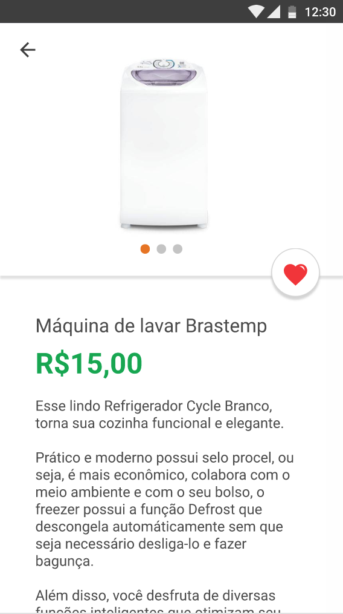
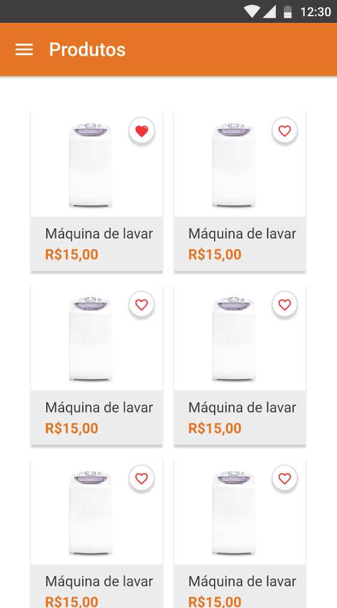

# Fu2re Smart Solutions - Desafio React Native

### Bem vindo ao Desafio React Native da Fu2re.

Você deverá criar um app utilizando o layout fornecido por nós.
Disponibilizamos um aquivo json contendo toda a estrutura e dados que você irá precisar para montar a aplicação.

Pense no desafio como uma oportunidade de mostrar todo o seu conhecimento.

O que queremos avaliar aqui é:

- Consumo de APIs;
- Habilidade de construção de telas seguindo o layout;
- Organização de componentes;
- Seu conhecimento sobre Redux;
- Como irá disponibilizar os dados (json) remotamente para o aplicativo;
- Organização de commits

# Features

---

### Precisa ter:

- Tela inicial contendo a lista de produtos;
- Quando clicar em um produto, abrir a tela de detalhe do produto;
- Slideshow com imagens do produto;
- Ao clicar em ver mais, deslizar a view e mostrar o conteúdo escondido;
- Ao clicar no coração, favoritar aquele item utilizando redux (inclusive atualizando na tela inicial também);
- Loading e tratamento de erros no request;

### Ganha pontos se tiver (opcional):

- Menu lateral;
- Tela de Busca;
- Testes unitários;
- Paginação com scroll infinito;
- Animações em geral;
- React Hooks

# Layout

---

Abaixo podemos ver algumas telas de exemplo para o desenvolvimento. para ter acesso ao Adobe XD, você poderá utilizar [este link ](https://xd.adobe.com/spec/feb31ec1-556f-4055-47e3-24c0f1cd2a59-8882/) para ver o spec e [este link ](https://xd.adobe.com/view/a82f8c6c-3fee-441a-71ad-7456f6eba874-de1e/) para acessar o protótipo. Mas se o seu lado designer falar mais alto, pode nos surpreender!

## **Processo de submissão**

---

Depois de implementar a solução, envie um pull request para este repositório.
O processo de Pull Request funciona da seguinte maneira:

1. Faça um fork deste repositório (não clonar direto!);
2. Faça seu projeto neste fork;
3. Commit e suba as alterações para o **seu** fork;
4. Pela interface do Github, envie um Pull Request.
5. Responda o email para o RH informando que terminou o desafio e informe o link do repositório.

Deixe o fork público para facilitar a inspeção do código.
